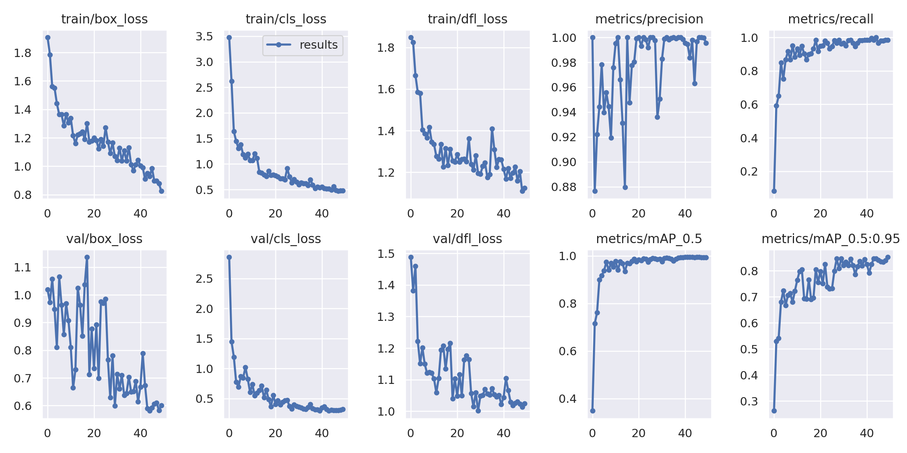

# Detect and Track Bubbles 

The tracking algorithm should remember the bubble number and bounding box even if another bubble passes over it. This project is Dockerized and install the yolov9 locally.

## Create Custom Dataset
I created my own dataset and use ROBOFLOW for annotating with YOLOv9. It became 31 images.  


Then I did my own augmentations to enhance the trained model.


So my project version is generated on Apr 9, 2024.


## Training
For Train YOLOv9 on a Custom Dataset I used this notebook:

<a href="https://github.com/roboflow/notebooks/blob/main/notebooks/train-yolov9-object-detection-on-custom-dataset.ipynb" target="_blank">How to Train YOLOv9 on a Custom Dataset</a>

<!-- [Link to section](https://github.com/yourusername/yourrepository/blob/main/path/to/file.md) -->

### Clone and Install

YOLOv9 is very new. At the moment, they recommend using a fork of the main repository. The detect.py script contains a bug that prevents inference. This bug is patched in the fork.
```bash
git clone https://github.com/SkalskiP/yolov9.git
cd yolov9
pip install -r requirements.txt -q
```

### Authenticate and Download the Dataset

I used this code to connect to my dataset from the Roboflow and I used version(1): 
```bash
!pip install roboflow

from roboflow import Roboflow
rf = Roboflow(api_key="5gekjLhYgxZ9u4KnCJGz")
project = rf.workspace("isu-cede4").project("dot_track_vid")
version = project.version(1)
dataset = version.download("yolov9")
```

### Examine Training Results
By default, the results of each subsequent training sessions are saved in {HOME}/yolov9/runs/train/, in directories named exp, exp2, exp3

I put my runs directory in the utils folder and the results save in the exp2.





## Running the circle detector
Now by the Docker When you run the main.py in the src folder. For the circle detection I define the X1, Y1, X2, Y2. By this locations I define the circle center and radios and add the circles to the frame. I log the circles location in the txt file also.

<!-- <video width="320" height="240" controls>
  <source src="results/output.mp4" type="video/mp4">
  Your browser does not support the video tag.
</video> -->

<!-- <iframe width="560" height="315" src="https://www.youtube.com/embed/Mr20y5P3HjE?si=jrfkPMXP5l5J2tcM" title="YouTube video player" frameborder="0" allow="accelerometer; autoplay; clipboard-write; encrypted-media; gyroscope; picture-in-picture; web-share" referrerpolicy="strict-origin-when-cross-origin" allowfullscreen></iframe>

[](https://www.youtube.com/watch?v=Mr20y5P3HjE) -->


<!-- https://github.com/BanisharifM/Dot_Track_Vid/assets/41099498/b572568d-8626-4352-83bf-e90e0850d7fe -->

### Video Output


### Circles Locations Logs


## Running the Container
To run the Docker container with the default settings, execute the following command in your terminal:
```bash
docker-compose up --build
```
