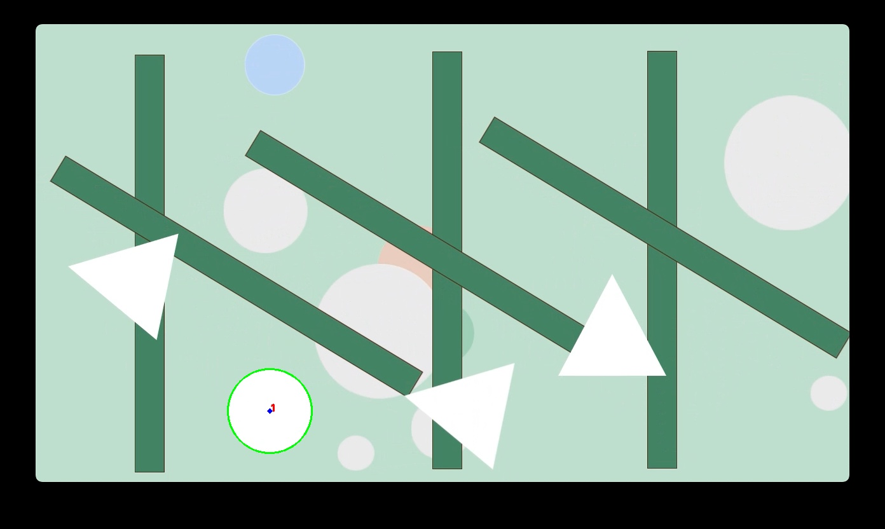

# Dot_Track_Vid V1

## Introduction
Dot_Track_Vid V1 utilizes the Hough Circle Transform for effective circle detection in images. This technique is implemented using OpenCV's `cv.HoughCircles()` function. For a detailed explanation of the Hough Circle Transform, refer to the [OpenCV Documentation](https://docs.opencv.org/4.x/da/d53/tutorial_py_houghcircles.html).

## Results
When the circle detection process is executed, the output for a single frame is saved in the results folder. Below is an example of the output image:



## Running the Container
To run the Docker container with the default settings, execute the following command in your terminal:
```bash
docker-compose up --build
